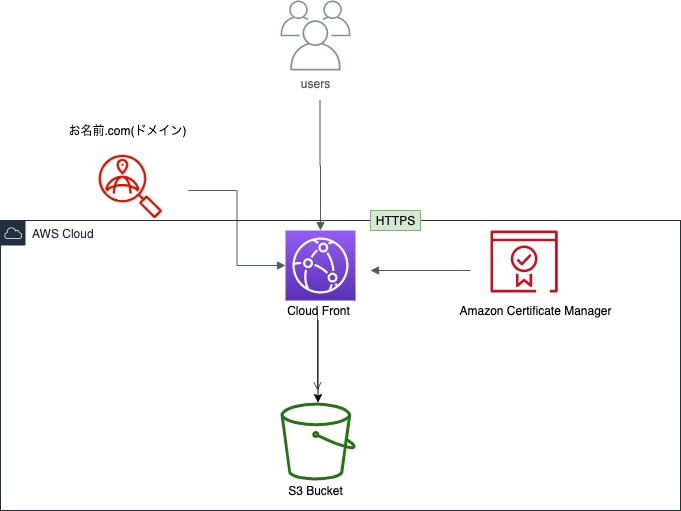

# 30 × 30とは

クリエイターの友人が作成するドキュメンタリーの掲載場所として、友人のために作成したサイトです。

ヘッドレスCMS「Contentful」を利用しデプロイはawsのS3で行うことにより、ノンプログラマーである友人が簡単かつ低コストでサイトへの投稿ができる様に実装しました。

# 使用技術

フロントエンドのみの静的サイトです。

使用技術は**Contentful(ヘッドレスCMS)、Bootstrap、html、css、JavaScript、JQuery**になります。

 
 

# インフラ図

